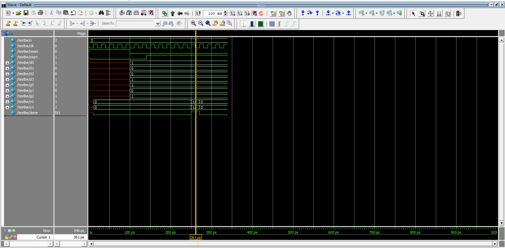
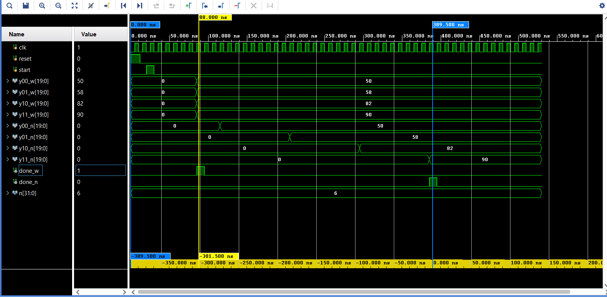

# Winograd F(2,3) Algorithm — From 1D Transform to 2D Transform Using Integer Inputs

## Overview
This project implements and verifies the Winograd F(2,3) convolution algorithm using integer arithmetic in Verilog and ModelSim.

The project starts with 1D Winograd transform implementation and extends toward 2D convolution comparison.

---

## Folder Structure

### src/
Contains the Verilog files for normal 2D convolution and Winograd-based convolution comparison.

### src_1d/
Contains Verilog modules related to the 1D Winograd transform implementation.

### tb/
Contains testbench files used for 2D convolution comparison and verification.

### tb_1d/
Contains testbench files for 1D Winograd transform verification.

### screenshots/
Contains waveform screenshots and simulation results from ModelSim/Vivado.

---

## Implemented Concepts
- 1D Winograd Transform
- Normal Convolution vs Winograd Convolution
- Integer-based computation
- Input Transform
- Output Transform
- Verilog simulation using ModelSim

---

## 1D and 2D Implementation

### 1D Winograd Transform
The 1D implementation demonstrates the basic Winograd F(2,3) transform using integer arithmetic and Verilog simulation.

### 2D Convolution Comparison
The 2D implementation compares normal convolution with Winograd-based convolution in terms of computation cycles and efficiency.

---

## Circuit / Datapath Description
The design performs Winograd-based convolution using transform equations instead of direct matrix multiplication.

The datapath mainly consists of:
- Adders
- Subtractors
- Intermediate transform stages
- Element-wise multiplication stage

The implementation avoids fractional arithmetic and uses integer inputs for simplified simulation.

---

## Performance Analysis

- Winograd convolution completed in fewer cycles compared to normal convolution.
- Simulation results show improved computational efficiency using the Winograd approach.
- The implementation uses integer arithmetic without fractional computation.

---

## Tools Used
- Verilog
- ModelSim
- Xilinx Vivado

---

## Simulation Results

### 1D Winograd Transform

### Normal Convolution vs Winograd Comparison

---

## Author
Phanidhar
